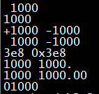
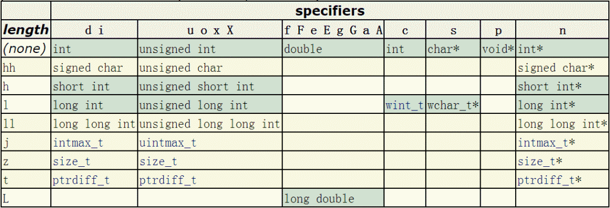

```c
d 以十进制形式输出带符号整数(正数不输出符号)              {字体 consolas 4号 }
o 以八进制形式输出无符号整数(不输出前缀0，需要前戳时放入# 例%#o 八)
x,X 以十六进制形式输出无符号整数(不输出前缀Ox，需要前戳时放入# 例%#x 十六)
u 以十进制形式输出无符号整数
f 以小数形式输出单、双精度实数
e,E 以指数形式输出单、双精度实数
g,G 以%f或%e中较短的输出宽度输出单、双精度实数
c 输出单个字符
s 输出字符串
m 打印strerror（errno）的输出。不需要参数。

2) 标志：标志字符为-、+、#、空格四种，其意义下表所示：
- 结果左对齐，右边填空格
+ 输出符号(正号或负号)
空格 输出值为正时冠以空格，为负时冠以负号
# 对c,s,d,u类无影响；对o类,在输出时加前缀o；对x类,在输出时加前缀0x；对e,g,f 类
当结果有小数时才给出小数点

3) 输出最小宽度:用十进制整数来表示输出的最少位数。若实际位数多于定义的宽度，则
按实际位数输出，若实际位数少于定义的宽度则补以空格或0。
* 星号。不显示指明输出最小宽度，而是以星号代替，在printf的输出参数列表中给出

4) 精度:精度格式符以“.”开头，后跟十进制整数。本项的意义是：如果输出数字，
则表示小数的位数；如果输出的是字符，则表示输出字符的个数；若实际位数大于
所定义的精度数，则截去超过的部分。

5).长度:长度格式符为h,l两种，h表示按短整型量输出，l表示按长整型量输出。

6).转义字符
\a报警		\b退格，后退	\f换页		\n换行		\r回车，到本行的开头
\t水平制表符	\v垂直制表符	\\反斜杠	\'单引号	\"双引号
\?问号		\Ooo八进制值	\xhh十六进制值
```


```c
// 范例代码

#include<stdio.h>
int main(void)
{
	char a = 37;//37在ASCLL表示 %
	//1byte=8bit
	//<complex.h>
	//复数   float_Complex    double_Complex    long double_Complex
	//虚数   float_Imaginary  double_Imaginary  long double_Imaginary
	//带字符整数类型 int, long ,long long (%d  %ld  %lld ）, short(%hd   
	//浮点数  double, float,long float,   (%f   %lf
	//无符号前置代码  unsigned   （%d  %u
	//有符号前置代码  signed     （表达语句无法赋值 
	//符号类型   char   (%c
	//布尔类型  _bool   (ture =1   false = 0) (%i
	//16(%x %#X %xd)   8(%o  %#o  %od)  指数输出(%e *10  %p  *2  %a *16
	printf("\t\t系统数据分配位数测试\n");
	printf("int=%d bytes.\n", sizeof(int));//%d输出
	printf("unsigned int=%d bytes.\n", sizeof(unsigned int));//%ud
	printf("short int=%d bytes.\n", sizeof(short int));//%hd
	printf("long=%d bytes.\n", sizeof(long));//%ld
	printf("long int=%d bytes.\n", sizeof(long int));//%ld
	printf("long long=%d bytes.\n", sizeof(long long));//%lld
	printf("short=%d bytes.\n", sizeof(short));//%hd
	printf("unsigned=%d bytes.\n", sizeof(unsigned));//%u
	printf("char=%d bytes.\n", sizeof(char));//%c
	printf("float=%d bytes.\n", sizeof(float));//%f
	printf("double=%d bytes.\n", sizeof(double));//%f
	printf("long double=%d bytes.\n", sizeof(long double));//%lf

//格式化输出类型  %类输出
	
	printf("\n\t\t格式化输出类型\n 1byte=8bit\n");
	printf("<complex.h>	\n");
	printf("复数   float_Complex    double_Complex    long double_Complex\n");
	printf("虚数   float_Imaginary  double_Imaginary  long double_Imaginary\n");
	printf("带字符整数类型 int, long ,long long (%c d  %c ld  %c lld ）, short(%c hd)\n"
		,a,a,a,a);
	printf(" 浮点数  double, float, long float, (%c f   %c lf\n",a,a);
	printf("无符号前置代码  unsigned   （%c d  %c u\n",a,a);		
	printf("有符号前置代码  signed     （表达语句无法赋值 \n");
	printf(" 符号类型   char(%c c		printf//布尔类型  _bool   (ture =1   false = 0) (%c i\n"
		, a,a);
	printf("16(%c x %c #X %c xd)   8(%c o  %c #o  %c od)  指数输出(%c e *10  %c p  *2  %c a *16\n"
		,a,a,a,a,a,a,a,a,a);
	printf("scanf 输入\n");

//转义字符
	//char b = 92;//92在ASCLL表示 /
	printf("\n\t\t转义字符\n");
	printf("\\a响铃	\\b退格	\\f换页	\\n换行	\\r回车	\\t水平制表符	\\v垂直制表符	\\\\反斜杠\n");
	printf("\\'单引号	\\""双引号	\\?问号	\\Ooo八进制值	\\xhh十六进制值 \n");
	getchar();
	return 0;

}
```


# 1.printf() 简介

printf() 是 C 语言标准库函数，用于将格式化后的字符串输出到标准输出。标准输出，即标准输出文件，对应终端的屏幕。printf() 申明于头文件 stdio.h。

**函数原型：**

```c
int printf ( const char * format, ... );
```

**返回值：**
正确返回输出的字符总数，错误返回负值。与此同时，输入输出流错误标志将被置值，可由指示器函数 ferror(FILE *stream) 来检查输入输出流的错误标志，如果 ferror() 返回一个非零值，表示出错。

**调用格式：**

```c
printf("格式化字符串", 输出表列)
```

格式化字符串包含三种对象，分别为：
（1）字符串常量；
（2）格式控制字符串；
（3）转义字符。

字符串常量原样输出，在显示中起提示作用。输出表列中给出了各个输出项，要求格式控制字符串和各输出项在数量和类型上应该一一对应。其中格式控制字符串是以 % 开头的字符串，在 % 后面跟有各种格式控制符，以说明输出数据的类型、宽度、精度等。

# 2.格式控制字符串详解

printf() 的格式控制字符串组成如下：

```c
%[flags][width][.prec][length]type
```

分别为：

```c
%[标志][最小宽度][.精度][类型长度]类型。
```

## 2.1 类型（type）

首先说明类型，因为类型是格式控制字符串的重中之重，是必不可少的组成部分，其它的选项都是可选的。type 用于规定输出数据的类型，含义如下：

| 字符 | 对应数据类型  | 含义                                                         | 示例                                                         |
| :--- | :------------ | :----------------------------------------------------------- | :----------------------------------------------------------- |
| d/i  | int           | 输出十进制有符号 32bits 整数，i 是老式写法                   | `printf("%i",123);`输出123                                   |
| o    | unsigned int  | 无符号8进制(octal)整数(不输出前缀0)                          | `printf("0%o",123);`输出0173                                 |
| u    | unsigned int  | 无符号10进制整数                                             | `printf("%u",123);`输出123                                   |
| x/X  | unsigned int  | 无符号16进制整数，x对应的是abcdef，X对应的是ABCDEF（不输出前缀0x) | `printf("0x%x 0x%X",123,123);`输出0x7b 0x7B                  |
| f/lf | float(double) | 单精度浮点数用f,双精度浮点数用lf(printf可混用，但scanf不能混用) | `printf("%.9f %.9lf",0.000000123,0.000000123);`输出0.000000123 0.000000123。注意指定精度，否则printf默认精确到小数点后六位 |
| F    | float(double) | 与f格式相同，只不过 infinity 和 nan 输出为大写形式。         | 例如`printf("%f %F %f %F\n",INFINITY,INFINITY,NAN,NAN);`输出结果为`inf INF nan NAN` |
| e/E  | float(double) | 科学计数法，使用指数(Exponent)表示浮点数，此处"e"的大小写代表在输出时“e”的大小写 | `printf("%e %E",0.000000123,0.000000123);`输出1.230000e-07 1.230000E-07 |
| g    | float(double) | 根据数值的长度，选择以最短的方式输出，%f或%e                 | `printf("%g %g",0.000000123,0.123);`输出1.23e-07 0.123       |
| G    | float(double) | 根据数值的长度，选择以最短的方式输出，%f或%E                 | `printf("%G %G",0.000000123,0.123);`输出1.23E-07 0.123       |
| c    | char          | 字符型。可以把输入的数字按照ASCII码相应转换为对应的字符      | `printf("%c\n",64)`输出A                                     |
| s    | char*         | 字符串。输出字符串中的字符直至字符串中的空字符（字符串以空字符’\0‘结尾） | `printf("%s","测试test");`输出：测试test                     |
| S    | wchar_t*      | 宽字符串。输出字符串中的字符直至字符串中的空字符（宽字符串以两个空字符’\0‘结尾） | `setlocale(LC_ALL,"zh_CN.UTF-8");`                           |

`wchar_t wtest[]=L"测试Test";`
`printf("%S\n",wtest);`
输出：测试test | | p | void* | 以16进制形式输出指针 | `printf("0x%p","lvlv");`输出：0x000000013FF73350 | | n | int* | 什么也不输出。%n对应的参数是一个指向signed int的指针，在此之前输出的字符数将存储到指针所指的位置 | `int num=0;`
`printf("lvlv%n",&num);`
`printf("num:%d",num);`
输出:lvlvnum:4 | | % | 字符% | 输出字符‘%’（百分号）本身 | `printf("%%");`输出:% | | m | 无 | 打印errno值对应的出错内容 | `printf("%m\n");` | | a/A | float(double) | 十六进制p计数法输出浮点数，a为小写，A为大写 | `printf("%a %A",15.15,15.15);`输出：0x1.e4ccccccccccdp+3 0X1.E4CCCCCCCCCCDP+3 |

**注意：**
（1）使用 printf() 输出宽字符时，需要使用 setlocale 指定本地化信息并同时指明当前代码的编码方式。除了使用 %S，还可以使用 %ls。

（2）printf() 输出 bool 类型无专用类型标识符，实际输出时按照整型 0 或 1 输出布尔值。

（3）%a 和 %A 是 C99 引入的格式化类型，采用十六进制 p 计数法输出浮点数。p 计数法类似 E 科学计数法，但有所不同。数以 0x 开头，然后是 16 进制浮点数部分，接着是 p 后面是以 2 为底的阶码。以上面输出的 15.15 为例，推算输出结果。15.15 转换成二进制为`1111.00 1001 1001 1001 1001 ...`，因为二进制表示数值的离散特点，计算机对于小数有时是不能精确表示的，比如 0.5 可以精确表示为 0. 1 2 0.1_2 0.12，而 0.15 却不能精确表示。将15.15 对应的二进制右移三位，为`1.1110 0100 1100 1100 1100 ...`转换对应的十六进制就是0x1.e4ccccccccccd，注意舍入时向高位进了1位。由于右移三位，所以二进制阶码是 3。最后的结果就是 0x1.e4ccccccccccdp+3。

（4）格式控制字符串除了指明输出的数据类型，还可以包含一些其它的可选的格式说明，依序有 flags, width, .precision and length。下面一一讲解。

## 2.2 标志（flags）

flags 规定输出样式，取值和含义如下：

| 字符  | 名称 | 说明                                               |
| :---- | :--- | :------------------------------------------------- |
| -     | 减号 | 结果左对齐，右边填空格。默认是右对齐，左边填空格。 |
| +     | 加号 | 输出符号(正号或负号)                               |
| space | 空格 | 输出值为正时加上空格，为负时加上负号               |
| #     | 井号 | type是o、x、X时，增加前缀0、0x、0X。               |

type是a、A、e、E、f、g、G时，一定使用小数点。默认的，如果使用.0控制不输出小数部分，则不输出小数点。
type是g、G时，尾部的0保留。| | 0 | 数字零 | 将输出的前面补上0，直到占满指定列宽为止（不可以搭配使用“-”） |

示例：

```c
printf("%5d\n",1000);     //默认右对齐,左边补空格
printf("%-5d\n",1000);     //左对齐,右边补空格

printf("%+d %+d\n",1000,-1000);  //输出正负号

printf("% d % d\n",1000,-1000);  //正号用空格替代，负号输出

printf("%x %#x\n",1000,1000);  //输出0x

printf("%.0f %#.0f\n",1000.0,1000.0)//当小数点后不输出值时依然输出小数点

printf("%g %#g\n",1000.0,1000.0); //保留小数点后后的0

printf("%05d\n",1000);    //前面补0
```

输出结果为：

## 2.3 输出最小宽度（width）

用十进制整数来表示输出的最少位数。若实际位数多于指定的宽度，则按实际位数输出，若实际位数少于定义的宽度则补以空格或0。width的可能取值如下：

| width | 描述                                                         | 示例                                |
| :---- | :----------------------------------------------------------- | :---------------------------------- |
| 数值  | 十进制整数                                                   | `printf("%06d",1000);`输出:001000   |
| *     | 星号。不显示指明输出最小宽度，而是以星号代替，在printf的输出参数列表中给出 | `printf("%0*d",6,1000);`输出:001000 |

## 2.4 精度（.precision）

精度格式符以“.”开头，后跟十进制整数。可取值如下：

| .precision | 描述         |
| :--------- | :----------- |
| .数值      | 十进制整数。 |

(1)对于整型（d,i,o,u,x,X）,precision表示输出的最小的数字个数，不足补前导零，超过不截断。
(2)对于浮点型（a, A, e, E, f ），precision表示小数点后数值位数，默认为六位，不足补后置0，超过则截断。
(3)对于类型说明符g或G，表示可输出的最大有效数字。
(4)对于字符串（s），precision表示最大可输出字符数，不足正常输出，超过则截断。
precision不显示指定，则默认为0 | | .* | 以星号代替数值，类似于width中的*，在输出参数列表中指定精度。|

示例：

```c
printf("%.8d\n",1000);   //不足指定宽度补前导0，效果等同于%08d
printf("%.8f\n",1000.123456789);//超过精度，截断
printf("%.8f\n",1000.123456); //不足精度，补后置0
printf("%.8g\n",1000.123456); //最大有效数字为8位
printf("%.8s\n",“abcdefghij”); //超过指定长度截断
```

输出结果：

```
00001000
1000.12345679
1000.12345600
1000.1235
abcdefgh
```

**注意：** 在对浮点数和整数截断时，存在四舍五入。

## 2.5 类型长度（length）

类型长度指明待输出数据的长度。因为相同类型可以有不同的长度，比如整型有 char（8bits）、short int（16bits），int（32bits）和 long int（64bits），浮点型有 32bits 的单精度 float 和 64bits 的双精度 double。为了指明同一类型的不同长度，于是乎，类型长度（length）应运而生，成为格式控制字符串的一部分。

因为 Markdown 表格不支持单元格合并，背景颜色等样式，所以直接引用C++ reference.printf http://www.cplusplus.com/reference/cstdio/printf/?kw=printf)的表格。


**注意：** 黄色背景行标识的类型长度说明符和相应的数据类型是C99引入的。

示例代码：

```c
printf("%hhd\n",'A');    //输出有符号char
printf("%hhu\n",'A'+128);   //输出无符号char
printf("%hd\n",32767);    //输出有符号短整型short int
printf("%hu\n",65535);    //输出无符号短整型unsigned short int
printf("%ld\n",0x7fffffffffffffff); //输出有符号长整型long int
printf("%lu\n",0xffffffffffffffff); //输出有符号长整型unsigned long int
```

输出结果：

```c
65
193
32767
65535
9223372036854775807
18446744073709551615
```

**注意：**
long int 到底是 32bits 还是 64bits 跟生成的程序是 32bits 还是 64bits 一一对应，如果使用 g++ 编译程序的话，可通过`-m32`或`-m64`选项分别生成 32bits 和 64bits 的程序。因本人测试代码编译生成的是 64bits 的程序，所以 long int 也就是 64btis。

# 3.转义字符

转义字符在字符串中会被自动转换为相应操作命令。printf() 使用的常见转义字符如下：

| 转义字符 | 意义           |
| :------- | :------------- |
| \a       | 警报（响铃）符 |
| \b       | 回退符         |
| \f       | 换页符         |
| \n       | 换行符         |
| \r       | 回车符         |
| \t       | 横向制表符     |
| \v       | 纵向制表符     |
| \\       | 反斜杠         |
| \"       | 双引号         |

# 4.关于 printf 缓冲

在 printf 的实现中，在调用 write 之前先写入 IO 缓冲区，这是一个用户空间的缓冲。系统调用是软中断，频繁调用，需要频繁陷入内核态，这样的效率不是很高，而 printf 实际是向用户空间的 IO 缓冲写，在满足条件的情况下才会调用 write 系统调用，减少 IO 次数，提高效率。

printf(…) 在 glibc 中默认为行缓冲，遇到以下几种情况会刷新缓冲区，输出内容：
（1）缓冲区填满；
（2）写入的字符中有换行符`\n`或回车符`\r`；
（3）调用 fflush(…) 手动刷新缓冲区；
（4）调用 scanf(…) 从输入缓冲区中读取数据时，也会将输出缓冲区内的数据刷新。

可使用`setbuf(stdout,NULL)`关闭行缓冲，或者`setbuf(stdout,uBuff)`设置新的缓冲区，uBuff 为自己指定的缓冲区。也可以使用`setvbuf(stdout,NULL,_IOFBF,0);`来改变标准输出为全缓冲。全缓冲与行缓冲的区别在于遇到换行符不刷新缓冲区。

printf(…) 在 VC++ 中默认关闭缓冲区，输出时会及时输到屏幕 [ 3 ] ^{[3]} [3]。如果显示开启缓冲区，只能设置全缓冲。因为微软闭源，所以无法研究 printf(…) 的实现源码。

Linux 和 Windows 下的缓冲区管理可见：C的全缓冲、行缓冲和无缓冲 http://blog.csdn.net/k346k346/article/details/63259524)。

# 5.printf 与 wprintf 不能同时使用

该小结写在 2018 年 1 月15 日。两年后的今日，在网上苦苦搜索寻求答案，终于解决了之前的疑惑。

在输出宽字符串时，发现将 printf 和 wprintf 同时使用时，则后使用的函数没有输出。这里建议不要同时使用 printf 和 wprintf，以免发生错误。

printf 和 wprintf 不能同时输出宽字符串的示例代码如下：

```c
#include <stdio.h>
#include <wchar.h>
#include <locale.h>

int main(int argc,char* argv[])
{
 char test[]="测试Test";
 setlocale(LC_ALL,"zh_CN.UTF-8");
    wchar_t wtest[]=L"0m~K0m~UTest";
 printf("printf:%S\n",wtest);     //语句1：可正常输出"测试Test"
    wprintf(L"wprintf:%S\n",wtest);  //语句2：无任何内容输出
}
```

上面的代码中语句 1 和语句 2 不能同时存在，否则只能正常输出第一个。也不知道在 Windows 平台是否也存在这种问题，有兴趣的读者可以尝试一下。关于原因，GNU 官方文档中有明确说明不能同时使用 printf 与 wprintf，参见The GNU C Library Section 12.6 Streams in Internationalized Applications http://www.gnu.org/software/libc/manual/html_node/Streams-and-I18N.html#Streams-and-I18N)，内容如下：

```c
It is important to never mix the use of wide and not wide operations on a stream. There are no diagnostics issued. The application behavior will simply be strange or the application will simply crash. 
```

这里是因为输出流在被创建时，不存在流定向，一旦使用了 printf(多字节字符串) 或 wprintf（宽字符串）后，就被设置为对应的流定向，且无法更改。可以使用如下函数获取当前输出流的流定向。

```c
//
//@param: stream：文件流；mode：取值可以 >0、=0 或 <0
//@ret: <0：流已被设置为多字节流定向；=0：流尚未被设置；>0：流已被设置为宽字符流定向
//
int fwide (FILE* stream, int mode);

//获取当前标准输出流定向
int ret=fwide(stdout,0);
```

通过 fwide 可以设置当前流定向，前提是未有任何的 I/O 操作，也就是当前流尚未被设置任何流定向。顺带吐槽一下，不知为何标准库函数 fwide 实现的如此受限。具体操作如下：

```c
//设置标准输出流定向为多字节流定向
fwide(stdout, -1);

//设置标准输出流定向为宽字符流定向
fwide(stdout, 1);
```

既然 GNU C 存在这个问题，那该如何解决呢？这里有两种办法：
（1）统一使用一种函数。
例如：

```c
wprintf(L"%s","a\n");
wprintf(L"b\n");

//或
printf("a\n");
printf("%ls\n", L"b");
```

（2）使用 C 标准库函数 freopen(…) 清空流定向。

```c
//重新打开标准输出流，清空流定向
FILE* pFile=freopen("/dev/tty", "w", stdout);
wprintf(L"wide freopen succeeded\n");

//重新打开标准输出流，清空流定向
pFile=freopen("/dev/tty", "w", stdout);
printf("narrow freopen succeeded\n");
```

上面可以让 printf(…) 与 wprintf(…) 同时使用。

# 6.小结

耗时将近两年，终于完成了此篇看似基础，但却纷繁复杂的 printf(…) 用法。由于时间和个人水平有限，文章不足之处在所难免，也请读者批评指正，不甚感激
