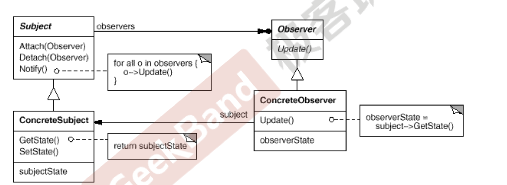

- [Gof模式分类](#Gof模式分类)
- [面向对象设计原则](#面向对象设计原则)
- [创建型模式](#创建型模式)
- [结构型模式](#结构型模式)
- [行为型模式](#行为型模式)

**变化是复用的天敌**

**面向对象设计的最大优势就是 抵御变化**

**稳定的代码应该写成 普通的成员函数**

**变化的代码应该写成 虚或纯虚成员函数**

**所有设计模式都依赖于一个 稳定点**

# Gof模式分类

- Gof 提出的设计模式有23个, **根据目的来看有下面的分类:**
  - **创建型(Creational)模式 : 如何创建对象;**
    - **将对象的部分创建工作延迟到子类或者其他对象，从而应对需求变化为对象创建时具体类型实现引来的冲击**
      - [简单工厂模式](#简单工厂模式),    [工厂方法模式](#工厂方法模式),   [抽象工厂模式](#抽象工厂模式),   [*单例模式](#单例模式).
  - **结构型(Structural)模式 : 如何实现类和对象的组合**
    - **通过类继承或者对象组合获得更灵活的结构，从而应对需求变化为对象的结构带来的冲击**
      - [代理模式](#代理模式), [装饰模式](#装饰模式), [外观模式](#外观模式), [适配器模式](#适配器模式). [Bridge桥模式](#Bridge桥模式)
  - **行为型(Behavioral)模式 : 类或对象怎样交互以及怎样分配职责.**
    - **通过类继承或者对象组合来划分类与对象间的职责，从而应对需求变化为多个交互的对象带来的冲击**
      - [模版方式模式](#模版方式模式), [命令模式](#命令模式), [策略模式](#策略模式), [观察者模式](#观察者模式).
  - **根据范围来看有下面分类:**
    - 类模式处理类与子类的静态关系
    - 对象模式处理对象间的动态关系
- 有一个 "简单工厂模式" 它不属于 GOf  23 种设计模式, 但大部分的设计模式书籍都会对它进行专门的介绍.
- **设计模式目前种类:  Gof 的 23种 + "简单工厂模式" = 24 种.**

1. 设计习语 Design Idioms
   1. Design Idioms 描述与特定编程语言相关的低层模式，技巧,  惯用法。
2. **设计模式 Design Patterns**
   1. Design Patterns主要描述的是“类与相互通信的对象之间的组 织关系，包括它们的角色、职责、协作方式等方面。
3. 架构模式 Architectural Patterns
   1. Architectural Patterns描述系统中与基本结构组织关系密切的 高层模式，包括子系统划分，职责，以及如何组织它们之间关 系的规则。

## 面向对象设计原则

> ==**很重要.  设计模式的基础是 多态.**==
>
> - **单一职责原则**: 类的职责单一,对外只提供一种功能,而引起类变化的原因都应该只有一个.
> - ==**开闭原则** : 类的改动是通过增加代码进行的,而不是修改源代码. 做到对扩展开放,对修改关闭.==
>   -  [面向对象设计原则-开闭原则.cpp](程序设计范例/面向对象设计原则-开闭原则.cpp) 
> - **里氏代换原则**: 任何抽象类出现的地方都可以用它的实现类进行替换,实际就是虚拟机制,语言级别实现面向对象功能.
> - ==**依赖倒转原则: 依赖于抽象(接口),不要依赖具体的实现(类),也就是针对接口编程. 并且注意稳定性!**==
>   -  [面向对象设计原则-依赖倒转原则.cpp](程序设计范例/面向对象设计原则-依赖倒转原则.cpp) 
> - **接口隔离原则**: 不应该强迫用户的程序依赖他们不需要的接口方法.一个接口应该只提供一个对外功能,不要把所有操作都封装在一起.
> - **合成复用原则**: 如果使用继承,会导致父类的任何变换都可能影响到子类的行为.如果使用对象组合,就降低了这种依赖关系.优先用组合.
>   -  [面向对象设计原则-合成复用原则.cpp](程序设计范例/面向对象设计原则-合成复用原则.cpp) 
> - ==**迪米特法则: 一个对象应当对其他对象尽可能少的了解,从而降低各个对象之间的耦合,提高系统的可维护性.**==
>   - ==**例如在一个程序中,各个模块之间相互调用时,通常会提供一个统一的接口来实现.这样其他模块不需要了解另一个模块的内部实现细节,这样当一个模块内部的实现发生改变时,不会影响其他模块的使用. (黑盒原理).**==
>   - **又叫最少知识原则. 知道的越少,而且还能把事情完成 就行.**
>   -  [面向对象设计原则-迪米特法则.cpp](程序设计范例/面向对象设计原则-迪米特法则.cpp) 
> - **封装变化点原则:** 使用封装来创建对象之间的分界层，让设计者可以在分界层的 一侧进行修改，而不会对另一侧产生不良的影响，从而实现层 次间的松耦合
> - **针对接口编程，而不是针对实现编程原则:** 
>   - 不将变量类型声明为某个特定的具体类，而是声明为某个接口
>   - 客户程序无需获知对象的具体类型，只需要知道对象所具有的 接口
>   - 减少系统中各部分的依赖关系，从而实现“高内聚、松耦合” 的类型设计方案

> 1. **法则表现在程序种形式:**
>    1. **开闭原则**  对外扩展开放, 对修改关闭, 增加功能是通过增加代码而实现的,而不是去修改源代码. 
>    2. **迪米特法则** 又叫最少知识原则. 知道的越少,而且还能把事情完成 就行.
>    3. **复用原则**  选择继承和组合的时候,优先使用组合 .

- **底层思维**
  - 向下,  把握机器底层从微观理解对象构造
    - 语言构造
    - 编译转换
    - 内存模型
    - 运行时机制
      - **封装, 隐藏内部实现**
      - **继承, 复用现有代码**
      - **多态, 改写对象行为**
- **抽象思维**
  - 向上, 将周围的世界抽象为程序代码 (两者都重要,  设计模式更注重这个)
    - 面向对象
      - 理解隔离变化
      - 各司其职
    - 组件封装
    - 设计模式
    - 架构模式

- 解决复杂性:
  - 分解
  - 抽象

# 创建型模式

**创建型(Creational)模式 : 如何创建对象;**

## 简单工厂模式

[简单工厂模式-抽象不完全代码](./程序设计范例/简单工厂模式-抽象不完全.cpp)

- 工厂是个类,里面包含了创建其他类的方法,其中有个对象生成器.  使用的时候应该传入一个参数,让工厂知道应该创建什么对象.
  - **优点**: 
    - 客户端和具体实现类 解耦合.
    - 对于某些对象创建过程比较复杂的情况,我们就不用考虑了.
  - **缺点**: 
    - 简单工程模式,增加新的功能是通过修改源代码实现的, 不符合开闭原则.
    - 这个类的职责过重.一旦这个类发生问题,会影响很多使用这个工厂的模块.
  - **使用场景**:
    - 工厂类负责创建的对象比较少, 由于创建的对象较少不会造成工厂方法中的业务逻辑太过复杂.
    - 客户端只需要知道传入工厂类的参数,对于如何创建对象并不关心.

## 工厂方法模式

[工厂方法模式-符合开闭原则-抽象完全.cpp](./程序设计范例/工厂方法模式-符合开闭原则-抽象完全.cpp)

- **`工厂方法模式 = 简单工厂模式 + "开闭原则"`**
  - 就是把工厂也变成抽象类, 每增加一个对象,就增加一个具体的工厂类.  (很不好,成倍数增长的类).
  - **使用场景:**
    - 客户端不知道他所需要的对象的类.
    - 抽象工厂类通过其子类来创建哪个对象.

## 抽象工厂模式

 [抽象工厂模式-产品族.cpp](./程序设计范例/抽象工厂模式-产品族.cpp) 

- 抽象工厂模式: 针对产品族, 而不是产品等级.
  - 产品族: 同一产地或者同一厂商,功能不同.
  - 产品等级: 功能相同,产地或者工厂不同.

## 单例模式

 [单例模式-饿汉式和懒汉式.cpp](./程序设计范例/单例模式-饿汉式和懒汉式.cpp) 

- **单例模式**: 控制某个类型的对象个数,单例模式中,系统只有一个对象.
  - **实现单例步骤**:    单例在程序中只会存在一份 , 所以不考虑内存泄露问题,也不需要提供析构函数.
    - 构造函数私有化.
    - 增加静态私有的当前类的指针变量.
    - 提供一个静态对外接口,可以让用户获得单例对象.
- **单例模式也分为 懒汉式和 饿汉式.  (饿汉式更加安全)**
  - **他们的区别是, 饿汉式的类对象在main之前就构建,懒汉式的类是在需要的时候构建.**
    - **但是懒汉式碰到多线程 会可能不安全,有可能会创建两个对象,这样就不是单例了.**
    - **饿汉式碰到多线程也会保持单例模式,所以不需要担心会不安全.**

# 结构型模式

**结构型(Structural)模式 : 如何实现类和对象的组合;**

## 代理模式

 [代理模式.cpp](./程序设计范例/代理模式.cpp) 

- **代理模式**: 为其他对象提供一种代理 以控制对这个对象的访问.  (参考代理服务器 , 类似于智能指针)
  - **不让用户直接申请到对象,而且间接来提供,有的时候也可以进行验证.**

## 装饰模式

 [装饰模式.cpp](程序设计范例/装饰模式.cpp) 

- 装饰模式 : 又称包装模式, 通过一种对客户端透明的方式来扩展对象功能, 是继承关系的一种替代.
- 装修模式 可以动态给一个类增加功能.
- 动态(组合)地给一个对象增加一些额外的职责。就增加功 能而言，Decorator模式比生成子类(继承)更为灵活(消 除重复代码 & 减少子类个数)。

> - 通过采用组合而非继承的手法， Decorator模式实现了在运行时 动态扩展对象功能的能力，而且可以根据需要扩展多个功能。避免 了使用继承带来的“灵活性差”和“多子类衍生问题”
> - Decorator类在接口上表现为is-a Component的继承关系，即 Decorator类继承了Component类所具有的接口。但在实现上又 表现为has-a Component的组合关系，即Decorator类又使用了 另外一个Component类。
> - Decorator模式的目的并非解决“多子类衍生的多继承”问题， Decorator模式应用的要点在于解决“主体类在多个方向上的扩展 功能”——是为“装饰”的含义

## 外观模式

 [外观模式-子系统案例.cpp](程序设计范例/外观模式-子系统案例.cpp) 

 [外观模式-KTV案例.cpp](程序设计范例/外观模式-KTV案例.cpp) 

- **外观模式(Facade):** 就是将复杂的子系统抽象到同一个的接口进行管理,外界只需要通过此接口与子系统进行交互,而不必要直接与复杂的子类系统进行交互. 为一组具有类似功能的类群,提供一个一致的简单的界面.
  - **(Facade)外观角色: 为调用方,定义简单的调用接口**
  - **(SubSystem)子系统角色: 功能提供者. 指定提供功能的类群(模块或子系统).**

## 适配器模式

 [适配器模式.cpp](程序设计范例/适配器模式.cpp) 

- **适配器模式 就是将已经写好的接口, 但是这个接口不符合需求, 将写好的接口转换成目标接口.**
  - **主要用到的是抽象类, 一个返回子类的函数, 一个子类伪函数. 一个需要转换的接口.**

## Bridge桥模式

 [Bridge桥模式.cpp](程序设计范例/Bridge桥模式.cpp) 

- 在软件组件的设计中，如果责任划分的不清晰，使用继承得到的 结果往往是随着需求的变化，子类急剧膨胀，同时充斥着重复代码， 这时候的关键是划清责任。
  - Bridge桥模式 就是典型
- **Bridge桥模式的定义就是**  将抽象部分(业务功能)与实现部分(平台实现)分离，使它们 都可以独立地变化。
- Bridge模式使用“对象间的组合关系”解耦了抽象和实现之间固 有的绑定关系，使得抽象和实现可以沿着各自的维度来变化。所谓 抽象和实现沿着各自纬度的变化，即“子类化”它们。
- Bridge模式有时候类似于多继承方案，但是多继承方案往往违背 单一职责原则(即一个类只有一个变化的原因)，复用性比较差。 Bridge模式是比多继承方案更好的解决方法。
- Bridge模式的应用一般在“两个非常强的变化维度”，有时一个 类也有多于两个的变化维度，这时可以使用Bridge的扩展模式。

# 行为型模式

**行为型(Behavioral)模式 : 类或对象怎样交互以及怎样分配职责.**

## 模版方式模式

 [模版方法模式.cpp](程序设计范例/模版方法模式.cpp) 

- **模版方法模式**: 指定一个操作中算法稳定的的框架,而将一些步骤延迟到子类中.
- **模版方法使得子类可以不改变一个算法的结构即可重定义该算法的某些特定步骤.**
- **模版方法模式的优缺点:**
  - **优点:**
    - 在父类中形式化的定义一个算法,而用它的子类来实现细节的处理,在子类实现详细的处理算法时 并不会改变算法中步骤的执行次序.
    - 模版方法模式是一种代码复用技术,它在类库设计中尤为重要,它提取了类库中的公共行为,将公共行为放在了父类中,而通过其子类来实现不同的行为,它鼓励我们恰当使用继承来实现代码复用.
    - **可实现一种反向控制结构,通过子类覆盖父类的钩子方法来决定某一步骤是否需要执行.**
    - 在模版方法模式中可以通过子类来覆盖父类的基本方法,不同的子类可以提供基本方法的不同实现,更换和增加新的子类很方便,符合 **单一职责原则** 和 **开闭原则**.  

## 命令模式

 [命令模式.cpp](程序设计范例/命令模式.cpp) 

命令模式 :对象指针和多态的运用.  (一定要看范例.).

## 策略模式

 [策略模式.cpp](程序设计范例/策略模式.cpp) 

- 策略模式 定义了一系列的算法,并将每个算法封装起来, 而且使他们还可以相互替换. 
- 策略模式让算法独立于使用它的客户而独立变化.
- **Context(环境类) : 是使用算法的角色,它在解决某个问题(即实现某个方法)时可以采用多种策略.用于定义所采用的策略.**
- **Stategy(抽象策略类): 它为所支持的算法声明了抽象方法,是所有策略类的父类,它可以是抽象类或具体类,也可以是接口.**
- **ConcreteStrategy(具体策略类): 它实现了在抽象策略类中声明的算法,在运行时,具体策略类将会覆盖在环境类中定义的抽象策略对象,使用一种具体的算法实现某个业务处理.**

## 观察者模式

 [观察者模式.cpp](程序设计范例/观察者模式.cpp) 

- 观察者模式:  一个类的变化可以引起其他的很多类发生变化. 发生改变的对象被称为观察目标,而被通知的对象称为观察者.

