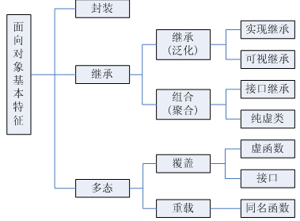

## 面向对象

面向对象程序设计（Object-oriented programming，OOP）是种具有对象概念的程序编程典范，同时也是一种程序开发的抽象方针。

面向对象三大特征 —— 封装、继承、多态

### 封装

把客观事物封装成抽象的类，并且类可以把自己的数据和方法只让可信的类或者对象操作，对不可信的进行信息隐藏。关键字：public, protected, private。不写默认为 private。

- `public` 成员：可以被任意实体访问
- `protected` 成员：只允许被子类及本类的成员函数访问
- `private` 成员：只允许被本类的成员函数、友元类或友元函数访问

### 继承

- 基类（父类）——> 派生类（子类）

### 多态

- 多态，即多种状态（形态）。简单来说，我们可以将多态定义为消息以多种形式显示的能力。
- 多态是以封装和继承为基础的。
- C++ 多态分类及实现：
  1. 重载多态（Ad-hoc Polymorphism，编译期）：函数重载、运算符重载
  2. 子类型多态（Subtype Polymorphism，运行期）：虚函数
  3. 参数多态性（Parametric Polymorphism，编译期）：类模板、函数模板
  4. 强制多态（Coercion Polymorphism，编译期/运行期）：基本类型转换、自定义类型转换